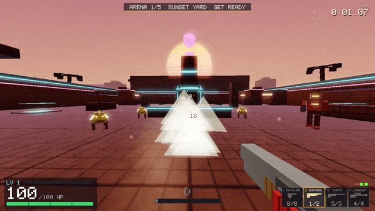

# OVERDRIVE

[](https://github.com/Ollie1o1/3d_shooter/actions/workflows/ci.yml)

**[▶ Play it in your browser](https://oliver-raczka.vercel.app/work/overdrive/#play)**, no install needed.



A 3D arena shooter built with **SDL2**, **OpenGL 3.3 Core Profile**, and **GLM**. ULTRAKILL-inspired movement with grapple hook, dashing, four weapons (including two bolt-action snipers) and style scoring, in two modes:

- **ARENA**: **four themed arenas** (sunset yard, foundry, a vertical spire you have to climb, a night-time reactor) of three waves each, **eight enemy types** built as animated block rigs (including the armored Juggernaut, built to be parried), and a **boss fight** at the end.
- **FAST**: **the Gauntlet**, a time trial through seven rooms joined by **boost tubes**: doors part as you sprint at them, lock behind you when a room's fight starts, and the exit unlocks when it's clear. A long canal, a close-quarters pump room, a cathedral of terraces, a canyon of islands over a void, a tower you fall through, a hall with control rooms, and a courtyard finale with a lift shaft to the beacon. Run clock, splits against your best run, par ranks.

Kills earn **XP** (more for stylish play), and levels buy **weapon upgrades** in the Armory.

Builds and runs on **macOS**, **Windows** (via MSYS2), and **in the browser** (WebAssembly + WebGL2 via Emscripten). It also builds and passes its physics tests on **Linux** (Ubuntu 24.04), though it hasn't been play-tested on a Linux desktop yet.

---

## Requirements

### macOS

```sh
brew install sdl2 sdl2_mixer glm llvm
```

> The Makefile prefers Homebrew LLVM (some Command Line Tools installs ship a `clang++` that can't find the C++ stdlib headers) and falls back to Apple clang if LLVM isn't installed. The macOS SDK path is detected with `xcrun`, so nothing needs editing.

### Linux (Debian/Ubuntu)

```sh
sudo apt install g++ make libsdl2-dev libsdl2-mixer-dev libglew-dev libglm-dev
make && make test
```

### Windows (MSYS2)

1. Install [MSYS2](https://www.msys2.org/) if you haven't already.
2. Open the **MSYS2 UCRT64** shell and run:

```sh
pacman -S mingw-w64-ucrt-x86_64-gcc \
          mingw-w64-ucrt-x86_64-SDL2 \
          mingw-w64-ucrt-x86_64-SDL2_mixer \
          mingw-w64-ucrt-x86_64-glm \
          mingw-w64-ucrt-x86_64-glew \
          make
```

---

## Build & Run

Shaders and assets are loaded relative to the binary, so `./shooter` can be launched from any directory.

### macOS

```sh
make        # compile → ./shooter
make run    # compile + run
make test   # headless tests: physics, level data, AI, a simulated full run
make clean  # delete binaries

./shooter --play                 # skip the main menu and start an ARENA run
./shooter --fast                 # skip the main menu and start the FAST time trial
./shooter --arena 4 --wave 3     # jump straight to an arena / wave (here: the boss)
./shooter --fast --arena 3       # jump to a FAST section (here: the chasm)
./shooter --god                  # take no damage (for recording footage)

# Dev: render N frames, save the last as a BMP and quit (the mouse is ignored)
./shooter --arena 3 --cam 0 3 -129 -90 18 --weapon 4 --aim --shot 90 shot.bmp
#         --cam X Y Z YAW PITCH   --weapon 1-4   --aim   --overlay armory|pause|settings
```

### Browser (WebAssembly)

The same C++ compiles to WebAssembly with [Emscripten](https://emscripten.org), rendering through WebGL2:

```sh
source ~/emsdk/emsdk_env.sh     # once per shell
make web                        # → web/dist/ (≈1.5 MB: wasm + preloaded shaders/sounds)
python3 -m http.server -d web/dist 8000   # open http://localhost:8000 (?play skips the menu, ?fast starts the time trial; ?arena=4&wave=3 jumps to the boss)
```

What the port needed (all behind `#ifdef __EMSCRIPTEN__`, so the desktop build is unchanged):

- `gl.h` includes GLES3; `ShaderProgram` rewrites `#version 330 core` to `#version 300 es` plus default precision at load time, so one set of shaders serves both builds (keep them free of implicit int→float conversions and uniform initializers, which GLSL ES rejects).
- `main.cpp` runs one `App::frame()` per `requestAnimationFrame` instead of a blocking loop.
- Browsers use Escape to release the mouse, so losing pointer lock pauses the game; **P** also pauses.
- Settings and best times are saved to `localStorage` (the Emscripten filesystem is in-memory and forgotten on reload), through `Persist.h`.
- The shell requests pointer lock with `unadjustedMovement` (raw mouse input) where supported; together with `MouseFilter.h` this stops the occasional huge bogus mouse delta Chrome reports, which used to snap the view round 180°.

### Windows

Open the **MSYS2 UCRT64** shell (`C:\msys64\ucrt64.exe`), navigate to the project folder, then:

```sh
make              # compile → shooter.exe
make run          # compile + run
make clean        # delete binary
```

> **Important:** use the MSYS2 UCRT64 shell, not PowerShell or cmd. The Makefile auto-detects the platform.

> **Runtime DLLs:** The game links against DLLs in `C:\msys64\ucrt64\bin` (`SDL2.dll`, `glew32.dll`, `libstdc++-6.dll`, etc.). `make run` works automatically because the UCRT64 shell already has that directory on `PATH`. If you want to run `shooter.exe` outside the shell (e.g. by double-clicking), either add `C:\msys64\ucrt64\bin` to your system `PATH`, or copy those DLLs next to `shooter.exe`.

---

## Controls

| Input | Action |
|-------|--------|
| W A S D | Move |
| Mouse | Look |
| Space | Jump / Double jump |
| Left Shift | Dash (directional) |
| Left Mouse | Fire weapon |
| Right Mouse | Aim down sights / scope (Kar98 / Longshot) |
| Q | Grapple hook (rebind in Settings: Q, E, Mouse 4, Mouse 5 or Middle Mouse) |
| 1 2 3 4 / Scroll | Revolver, Shotgun, Kar98, Longshot |
| Tab | Armory: spend upgrade points (pauses the game) |
| G | Throw grenade |
| R | Reload / Retry the arena (on death) |
| F | Punch: parries projectiles, breaks a Juggernaut's smash, detonates your grenade, hits what's in front |
| Left Ctrl / C | Crouch / Ground slam |
| Enter | New run (on death/win) |
| Escape / P | Pause / Resume (Escape quits to menu from death/win screens; in a browser, Escape releases the mouse and pauses) |

---

## Features

### Modes
- **ARENA** — four arenas, three waves each, the Warden at the end. Optional run timer; your best time is saved.
- **FAST: the Gauntlet** — seven rooms, each reached down a ribbed **boost tube** (a breather: health waiting, nothing shooting at you) that fires you along at 26 m/s. Step into the room and the fight starts: the door behind you locks, and the exit unlocks when the room is clear. A waypoint points to the exit.
  1. **The Canal** (north): a sunken lane between raised walkways, bridges across it
  2. **The Ascent** (turn left, climb): five terraces up 20 m, each riser with a pad and a step block; gunners hold the high ground
  3. **The Span** (north, 23 m up): islands, a beam, ferries and grapple anchors over a void (fall and you're back at the landing)
  4. **The Well** (turn right, drop): a tower you fall through, floor by floor, gunners on each
  5. **The Pumpworks** (east): a roofed tunnel with a lava strip opening into a hall with galleries
  6. **The Tower**: win the courtyard (two waves), then ride the lifts or grapple to the beacon on top

  A 3-2-1 countdown starts the clock; every room clear shows a split (green ahead / red behind your best run); the clock stops at the beacon. Ranked S/A/B/C/D against par times. Dying (or Backspace) restarts the room with the clock still running.

### Combat
- **Revolver** (slot 1) — 8-round hitscan with auto-reload
- **Shotgun** (slot 2) — 2-shell pump-action, 10 pellets per shot with spread
- **Kar98** (slot 3) — bolt-action rifle. RMB raises the iron sights (a small zoom; the front post sits in the rear notch on screen centre). 120 damage, 2.5x on the head: a headshot one-shots anything but the boss. Accurate aimed, loose from the hip or in the air
- **Longshot** (slot 4) — heavy .50 sniper. RMB brings up a full scope (mil-dot reticle, heavy zoom). 300 damage one-shots every regular enemy and punches through three of them (**COLLATERAL**). Fire as the scope settles for a **QUICKSCOPE** bonus; kill without aiming for a **NOSCOPE** bonus
- Aiming scales mouse sensitivity with the zoom (plus a ZOOM SENSITIVITY setting) and slows you a little
- **Grenades** (G key) — parabolic arc, 5m blast radius, refill every 2 kills
- **Punch / parry** (F) — a fist you can see. Parries an enemy shot in front of you (the window grows with the shot's speed) and sends it where you're looking for 60; a Juggernaut's siege shell comes back for 400 and ignores armor. Punch a Juggernaut in the last moment of its smash to **break** it (staggered, double damage). Otherwise it hits whatever's in front of you. A parry lands with a metal clank, a gold flash and a hit-stop
- **Projectile Boost** (F near own grenade) — detonate for 3x damage AoE
- **Recoil recovery** — camera kick smoothly returns to center instead of drifting
- **Weapon switch animation** — smooth drop/raise transition with firing blocked during switch

### XP, upgrades and drops
- Kills give XP by enemy type, multiplied by your style rank (D x1 up to SSS x2); trick shots give bonuses
- Each level is an upgrade point. **Armory (Tab)**: per gun, three tiers each of DAMAGE (+20%), FIRE RATE (-15% between shots) and MAGAZINE (more rounds, faster reload), plus one MOD (2 points): Piercing Rounds, Dragon Breath (+5 pellets), Headhunter (Kar headshot kills refund the round and skip the bolt), Explosive Tips
- Upgrades survive dying and retrying; a new run starts at level 1
- **Drops**: health orbs (20%, small heal, magnetic), **health potions** (18%, +40 HP, red loot beam, only picked up when you're hurt so they wait for you) and **XP shards** (10%). Brutes always drop orbs and often a potion

### Movement
- Quake-style air strafing with momentum preservation
- Double jump, directional dash (2 charges), ground slam
- Grapple hook with slingshot release; **moving platforms** (lifts, sweepers, ferries, orbiting platforms) can be hooked with generous aim assist (cyan brackets on the crosshair) and pull you to land on top; standing on one carries you with it
- Sliding with momentum boost
- Every arena has an **invisible ceiling** (a force field that flashes when you hit it) so dashes and grapples can't launch you out over the walls

### Enemies
Every enemy is a rig of boxes on joints (hips, shoulders, wing roots) posed from its AI state each frame: legs swing with the walk cycle, wings flap, and arms come up to aim or slam during a wind-up, so you can read an attack before it lands. Each type teaches a different answer:

| Enemy | Looks like | What it does | Answer |
|-------|------------|--------------|--------|
| **Husk** | Humanoid rifleman, glowing visor | Holds mid range, strafes, fires slow orbs | Parry the orbs back (F) |
| **Ripper** | Low four-legged hound with blades | Zig-zags in, crouches, lunges | Dash out of the lunge |
| **Sentinel** | Tall cyclops sniper | Paints you with a laser, then fires a fast 3-round burst | Break line of sight while the laser is up |
| **Raptor** | Bird with a 4 m flapping wingspan | Circles overhead shooting, then dives at you | Watch the sky |
| **Brute** | 2.9 m heavy with a glowing chest core | Walks you down and slams the ground; lobs at range | Jump the shockwave |
| **Mite** | Small spider bomb | Rushes in and detonates | Shoot it early: its blast hurts its friends |
| **Juggernaut** | 3.3 m armored heavy with a cannon arm | Armor halves bullet damage; fires slow siege shells, smashes up close | Parry the shell (400 back), or punch the smash to break it |
| **Warden** | 4.6 m crowned boss | Volleys, slams, summons Mites and Rippers; enrages at half health | Everything above |

- Ground enemies steer around cover with feeler probes (no pathfinding; the arenas are open by design) and keep apart with soft separation
- Gunners and Brutes won't walk off a ledge; Rippers and Mites jump down after you
- Gunners check line of sight before firing and sidestep out from behind cover when blocked
- Enemies materialise in a column of light (untargetable for 0.9 s) and break apart into their blocks when killed
- Health orbs drop from kills (Brutes always drop three) and home in when you're close
- Headshots on humanoids deal 1.5x damage

### Arenas and waves
- **Four arenas**, each with its own lighting, fog and sky: the **Sunset Yard** (four corner buildings break the square into a plaza with four arms, and their rooftops are joined into a ring of bridges at 5 m, with market stalls to duck behind), **the Foundry** (roofed, lava channels you can lure enemies into, a furnace to climb, side and cross catwalks forming a loop at 5 m, a crane platform to grapple), **the Spire** (a 26 m tower at dawn: ledges, bridges, a balcony and the summit, linked by jump pads, lifts, sweepers and orbiting platforms; each wave spawns a tier higher, and the gunners up there hold their perch, so you have to climb), and **the Core** (night sky, a reactor ringed by pillars; an outer walkway ring at 4 m linking the corner perches and an inner ring at 7 m across the pillar tops). Every arena loops: there's always somewhere to run, on the ground or above it
- Each arena has three waves; the director keeps at most 6–10 enemies on the field and trickles the rest in as you kill, spawning them away from you
- New enemy types get a title card the first time they appear, with a one-line tip on how to beat them
- Clearing an arena opens its gate and points a waypoint at it; walking into the next arena closes the gate behind you
- **Jump pads** launch you onto platforms; the lighting blends between arenas as you walk the corridor
- The last three enemies of a wave get on-screen markers so you never hunt for a straggler
- Dying offers **retry this arena** (R) or a new run (Enter); enemy damage scales up from 70% in the first arena to 110% in the last

### Style System
- ULTRAKILL-inspired style meter (D → C → B → A → S → SSS)
- Style gained from kills, parries, dashes, slams, grenade multikills
- Overdrive mode at max style — dash charges refill on kill
- Style decays after 3 seconds of inactivity

### Visuals
- **Procedural textures** — grid concrete floor, brick walls, brushed metal ceiling (no external image files)
- **Procedural sky** — gradient, sun or moon (with synthwave bands in the Sunset Yard), stars and two mountain ridges, computed per pixel from the view direction
- Distance fog and hemisphere ambient per arena; self-lit neon trim; ACES filmic tone mapping
- World-space UV mapping for consistent texture tiling
- Bloom post-processing (bright pass → gaussian blur → composite)
- **CRT filter** (optional, toggle in settings) — barrel distortion, chromatic aberration, scanlines, vignette
- PSX-style vertex snapping (configurable)
- Hitscan tracers, muzzle flash, screen shake, hit-stop on kills
- Impact decals, explosion particles, shell casings
- Damage direction indicators on screen edges
- Dithered grapple rope rendering

### Audio
- **Procedural sound effects** — synthesized in Python (`tools/gen_sfx.py`): jumps, landings, slams, reloads, bolts, hits, kills, telegraphs, explosions, stingers, spawns, pickups, level-ups
- **Recorded sounds** from free CC0 (public domain) packs, cut, trimmed and layered by `tools/import_sfx.py`: the four gunshots (real pistol, shotgun and rifle recordings), the dash whoosh, the grapple, footsteps (four variations), the punch and the parry clank. Sources in [`assets/sfx/CREDITS.md`](assets/sfx/CREDITS.md)
- Every sound is trimmed to start within a few milliseconds of being triggered, so shots never feel late

### Game Flow
- **Victory screen** — after the Warden: time, kills, accuracy, deaths and a letter grade (S/A/B/C/D)
- **Death screen** — where you died, with retry-arena and new-run options
- **Pause menu** — Escape mid-run pauses: Resume / Settings / Restart / Quit to Menu
- R retries the current arena; Enter starts a new run
- **Settings** (main menu and pause menu, keyboard or mouse, sliders drag): field of view, fullscreen (also F11 / Alt+Enter), frame rate (match display, 60–360, unlimited), VSync, resolution scale, show FPS, CRT filter, screen shake, view bob, mouse sensitivity, zoom sensitivity, invert Y, mouse spike filter, master and music volume, **difficulty** (LENIENT / STANDARD / VIOLENT / BRUTAL — also LEFT/RIGHT on the main menu), run timer, damage numbers, crosshair colour
- **Soundtrack** — synthesized live (`MusicSynth.h`, no audio files): darksynth/industrial, a track per area, layers that build from the tubes into the fight and up again for the boss, muffled while paused
- **High refresh rates** — physics stays at a fixed 60 Hz while enemies, projectiles, pickups and platforms are interpolated between ticks, so 144/240/360 Hz is smooth; the frame limiter sleeps then spins to hold a cap to within microseconds. `./shooter --bench N [--cap HZ] [--res H]` prints frame times
- Settings and best times persist across launches (`settings.cfg` / `records.cfg` next to the binary; `localStorage` in the browser)

### HUD
- Health as a big number with a bar (pulses red when low), level and XP bar, four weapon slots with ammo counts and reload bars, grenade pips, style rank
- Floating damage numbers (gold on headshots), a kill/pickup feed, toasts for level-ups and trick shots, run timer and splits
- The whole HUD is batched into a few draw calls (`UIBatch.h`); it used to be one draw call per pixel of text

---

## Project Structure

```
3d_shooter/
├── src/
│   ├── main.cpp              # entry point, SDL/OpenGL init, App::frame() loop (desktop + web)
│   ├── GameState.h           # base state interface (menu / gameplay)
│   ├── MenuState.h           # main menu (ARENA / FAST / SETTINGS)
│   ├── SettingsMenu.h        # settings page shared by the main and pause menus
│   ├── Settings.h            # every option, saved via Persist.h
│   ├── Persist.h             # key → text store: files on desktop, localStorage on the web
│   ├── GameplayState.h       # core game loop: physics, combat, rendering
│   ├── Player.h              # kinematic character controller (Quake-style)
│   ├── Camera.h              # view/projection, mouselook
│   ├── Enemy.h               # enemy roster: stats + AI (no OpenGL, unit-tested)
│   ├── EnemyModel.h          # each enemy's animated box rig (no OpenGL)
│   ├── BoxRenderer.h         # one instanced draw for every box-built thing
│   ├── Projectile.h          # bullet/projectile system
│   ├── GrappleHook.h         # grapple hook physics
│   ├── StyleSystem.h         # style rank/score tracking
│   ├── Level.h               # ARENA map: four arenas, corridors, doors, pads, lava, movers, themes
│   ├── LevelGauntlet.h       # FAST map: the Gauntlet's seven rooms and their tubes
│   ├── Weapons.h             # the four guns' stats, upgrade maths, ammo/reload state
│   ├── Progression.h         # XP, levels, upgrade purchases, best times
│   ├── MouseFilter.h         # drops bogus single-event mouse spikes
│   ├── WaveDirector.h        # arena → wave → arena state machine (no OpenGL)
│   ├── Mesh.h                # VAO/VBO wrapper
│   ├── ShaderProgram.h       # GLSL compile/link, uniform helpers
│   ├── PostProcess.h         # bloom + optional CRT post-processing
│   ├── UIRenderer.h          # HUD, armory, pause, win/death screens, scope overlay
│   ├── UIBatch.h             # batched 2D quads + pixel-font text
│   ├── ViewModel.h           # first-person weapon models, aim-down-sights, bolt animation
│   ├── AudioSystem.h         # SDL2_mixer sound wrapper
│   ├── TextureGen.h          # procedural texture generation
│   ├── PixelFont.h           # bitmap font for UI text
│   ├── Interactable.h        # trigger volumes / interactable objects
│   ├── shader.vert/frag      # world geometry shader (Blinn-Phong, point lights)
│   ├── box_inst.vert/frag    # instanced box shader (enemies, debris, doors, pads…)
│   ├── skybox.vert/frag      # procedural sky (sun/moon, stars, mountains)
│   ├── ui.vert/frag          # HUD shader
│   ├── tracer.vert/frag      # bullet tracer shader
│   ├── particle.vert/frag    # coloured, distance-scaled particle points
│   ├── grapple.vert/frag     # dithered grapple rope shader
│   ├── crt.frag              # CRT post-process effect
│   ├── scope.frag            # sniper scope lens
│   ├── postprocess.vert      # fullscreen quad vertex shader
│   ├── bloom_bright.frag     # bloom brightness threshold pass
│   ├── bloom_blur.frag       # bloom gaussian blur pass
│   └── bloom_composite.frag  # bloom composite pass
├── assets/
│   └── sfx/                  # procedurally-generated sound effects (.wav)
├── tests/
│   ├── test_physics.cpp      # headless player-physics tests
│   └── test_game.cpp         # both maps, movers, AI, rigs, weapons, XP, mouse filter and
│                             # simulated ARENA and FAST runs (`make test`)
├── tools/
│   ├── gen_sfx.py            # synthesizes most of assets/sfx/*.wav
│   └── import_sfx.py         # builds the recorded sounds from CC0 packs (see assets/sfx/CREDITS.md)
├── web/
│   └── index.html            # browser shell for the WebAssembly build (`make web`)
├── Makefile
└── README.md
```

---

## How the Engine Works

### Game loop (fixed timestep)

Physics runs at exactly **60 Hz** regardless of display framerate. Elapsed time is accumulated and drained in fixed 1/60 s steps. Leftover time becomes an interpolation factor for rendering, so motion looks smooth at any framerate.

```
accumulator += elapsed_time
while accumulator >= PHYSICS_DT:
    physics.update(PHYSICS_DT)
    accumulator -= PHYSICS_DT
alpha = accumulator / PHYSICS_DT   # 0..1, used to lerp camera
```

### Movement (Quake-style)

Instead of `velocity = direction * speed`, acceleration is applied incrementally each tick:

```
currentSpeed = dot(velocity_horizontal, wishDir)
addSpeed     = clamp(maxSpeed - currentSpeed, 0, accel * dt)
velocity    += wishDir * addSpeed
```

Momentum is preserved in the air, so strafe-jumping can gain a small speed boost — the same mechanic behind Quake/Titanfall/ULTRAKILL movement feel.

### Rendering pipeline

Each frame:
1. Render the procedural sky, then the static level (one draw per texture: floors/tops, sides, undersides, neon)
2. Gather everything built from boxes — enemies, debris, projectiles, doors, jump pads, pickups, the reactor — into one instanced draw
3. Bloom pass — extract bright regions → gaussian blur → composite with ACES tone mapping
4. Optional CRT pass — barrel distortion, chromatic aberration, scanlines
5. Render HUD (objective line, boss bar, waypoints, title cards) and screens on top

World geometry is batched into as few draw calls as possible. Everything dynamic is a unit cube instance, so a wave of enemies plus their debris is still one `glDrawElementsInstanced` call.

### Collision

The player is an AABB. Each wall/platform is also an AABB. Collision is resolved by finding the axis of minimum penetration and pushing the player out along it. A spatial grid accelerates queries so only nearby walls are tested. Perimeter walls are low enough to stand on; what keeps you in the fight is a zone check that only allows the current arena (plus the corridor and next arena once it's cleared), with the zone's `max.y` as an invisible ceiling and an optional void plane below.

Moving platforms are ordinary walls flagged `dynamic`: `LevelData::updateMovers()` moves them every physics tick and records how far each went. They're left out of the spatial grid and tested every tick instead, the player remembers which wall it's standing on, and `GameplayState` adds that platform's movement to the player before the physics step, which is all "riding a platform" needs.

---

## Tuning Movement Feel

All knobs are public members of `Player` in `Player.h`:

| Variable | Default | Effect |
|----------|---------|--------|
| `horizontalSpeed` | 7.0 | Max ground speed (m/s) |
| `gravity` | -24.0 | Fall acceleration |
| `jumpForce` | 8.5 | Jump height |
| `acceleration` | 80.0 | Ground responsiveness |
| `airAcceleration` | 42.0 | Mid-air steering |
| `friction` | 10.0 | Ground deceleration |

---

## How to Extend

### Add a wall / platform

In `Level.h`, inside the arena's block in `buildLevel()`:

```cpp
wall(x0, y0, z0, x1, y1, z1, color);   // solid, rendered
prop(x0, y0, z0, x1, y1, z1, color);   // rendered only
neon(x0, y0, z0, x1, y1, z1, color);   // self-lit trim
```

`make test` then checks that no spawn point ended up inside it, that every jump pad still lands on its platform, and that no tall scenery sits inside an arena.

### Add a weapon

1. Add an id to `WeaponId` and a row to the table in `Weapons.h` (damage, pellets, spread, fire rate, magazine, reload, aim zoom, pierce, recoil, mod).
2. Add a `draw___()` model in `ViewModel.h` and a case in the `draw()` dispatch.
3. Add its sound name to `SND[]` in `GameplayState::fireWeapon()` (and to `SOUNDS[]` in `main.cpp`).
4. Give it an icon in `UIRenderer::drawWeaponIcon()`. The slots, Armory, ammo and reload all follow from the table.

### Add a moving platform

In `Level.h` (or `LevelGauntlet.h`): `B.mover(centre, halfSize, Mover::Path::PINGPONG, offsetA, offsetB, period, phase, glowColour)`, or `Path::ORBIT` with two radius vectors. `make test` sweeps every mover through two full periods and fails if it ever passes through a wall.

### Add an enemy type

1. Add a value to `EnemyType` and a row to the stats table in `Enemy.h` (health, size, speed, colours, tip text).
2. Write its `think…()` behaviour; report attacks through `ev` (shots, melee, slam…).
3. Build its rig in `buildEnemy()` in `EnemyModel.h`.
4. Add it to a wave in `Level.h`.

---

## Dependencies

| Library | Purpose | Platform |
|---------|---------|----------|
| SDL2 | Window, input, OpenGL context | all |
| SDL2_mixer | Sound effects | all |
| OpenGL 3.3 | Rendering | all |
| GLM | Math — vectors, matrices, transforms | all |
| GLEW | OpenGL function loader | Windows |
| LLVM/clang++ | Compiler (Homebrew) — replaces system clang | macOS |
